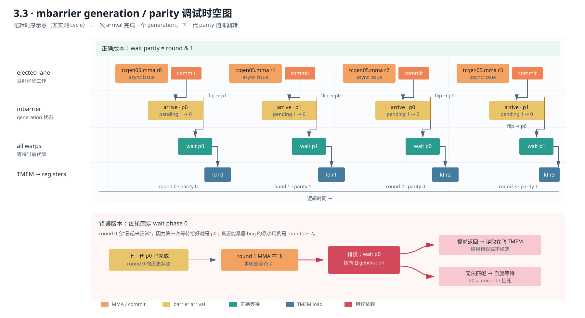

# 3.3 · mbarrier phase 调试

标准化实验元数据见 [`EXPERIMENT.md`](EXPERIMENT.md)。

状态：修复、错误版复现和 B300 判测均已完成。

实现文件：[`03_bug_mbarrier.cu`](03_bug_mbarrier.cu)

## 问题根因

程序每轮执行：

`mma -> commit(mbarrier arrive) -> wait -> tcgen05.ld`

mbarrier 是可复用的 generation barrier。一次 generation 完成后 phase
翻转，并把 pending arrival count 重置为初始化值。因此正确等待序列不是
固定 phase 0，而是：

`0, 1, 0, 1, ...`

修复代码使用：

```cpp
mbar_wait(mbar_addr, static_cast<uint32_t>(round & 1));
```

源码还提供 `BUGGY_PHASE` 宏，定义后恢复“每轮固定等待 phase 0”的错误，
用于复现实验。

## barrier 代际时空图



[SVG 矢量原图](figures/mbarrier-generation-timeline.svg) ·
[PNG 高清图](figures/mbarrier-generation-timeline.png)

图的上半部分把 elected lane 的异步发射、mbarrier arrival、所有 warp 的等待和
TMEM 读取放在同一时间轴上；下半部分单独放大错误版的第二轮。错误版在 round 1
仍等待 phase 0，此时 phase 0 已属于上一 generation：等待可能针对旧代际提前
返回，也可能永远匹配不到本轮完成事件。前者会让 `tcgen05.ld` 与尚未完成的
MMA 竞争，后者表现为挂死。

## 我们的调试判断

最容易误判的现象是错误版 `rounds=1` 也会 PASS。我们没有把这个单点结果当成
“barrier 写对了”，因为第一轮根本没有复用 barrier，固定 phase 0 恰好与正确
相位相同。于是测试被刻意扩展为 1/2/4 轮：2 轮是能触发代际翻转的最小反例，
4 轮用于观察错误是否会累积；再用两个 seed 排除输入偶然性，并用 20 s timeout
把“错误结果”和“等待旧代际导致的挂死”都纳入失败口径。这个判断路径比只给出
`round & 1` 的答案更重要：先找能区分两个假设的最小实验，再扩大覆盖范围。

## B300 现象

错误版本（`-DBUGGY_PHASE`，seed=42，单进程 20 秒超时）：

| rounds | 现象 |
|---:|---|
| 1 | PASS |
| 2 | 失败或超时 |
| 4 | 失败或超时 |

```text
PASS seed=42
BUGGY_R2_FAILED_OR_TIMEOUT
BUGGY_R4_FAILED_OR_TIMEOUT
```

修复版本：

```text
rounds=1 PASS seed=42
rounds=1 PASS seed=7
rounds=2 PASS seed=42
rounds=2 PASS seed=7
rounds=4 PASS seed=42
rounds=4 PASS seed=7
JUDGE: PASS
```

## 结论

barrier parity 描述的是某个 generation，而不是一个可以永久等待的固定
完成位。每次复用都必须推进 phase。并且只有等待当前 MMA batch 的 commit
arrival 后，才能执行依赖 TMEM 结果的 `tcgen05.ld`。

## 复现

```bash
nvcc -O3 -std=c++17 \
  -gencode arch=compute_100f,code=sm_100f \
  03_bug_mbarrier.cu -o /tmp/m33

nvcc -O3 -std=c++17 -DBUGGY_PHASE \
  -gencode arch=compute_100f,code=sm_100f \
  03_bug_mbarrier.cu -o /tmp/m33-bug
```

完整原始输出见 [B300 实验归档](../../docs/evidence/b300-results.md)。
