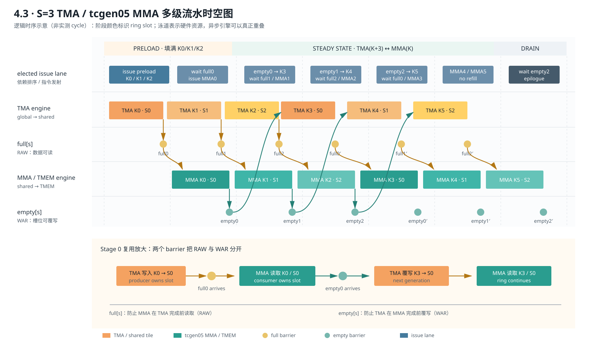

# 4.3 · 多级 TMA/MMA Pipeline

标准化实验元数据见 [`EXPERIMENT.md`](EXPERIMENT.md)。

状态：实现、cuBLAS 严格对拍、两种形状的 stage sweep 和分析均已完成。

实现文件：[`03_pipeline.cu`](03_pipeline.cu)

辅助脚本：

- [`sweep_stages.sh`](sweep_stages.sh)：S=2/3/4/6、两种形状；
- [`occupancy_stages.sh`](occupancy_stages.sh)：查询各 stage 的最大 resident blocks/SM；
- [`judge_ladder.sh`](judge_ladder.sh)：依次构建 4.1/4.2/4.3。

## 环形缓冲结构

每个 stage 保存一个 A tile 和一个 B tile，并配有两个 mbarrier：

- `full[s]`：TMA producer 完成后，MMA consumer 才能读取，解决 RAW；
- `empty[s]`：MMA commit 完成后，TMA producer 才能覆写，解决 WAR。

每 stage shared-memory 用量为：

`(128×64 + 64×64) × 2 B = 24576 B = 24 KiB`

S=3 已达到 72 KiB，超过 48 KiB 静态 shared-memory 限制。因此 A/B ring
buffer 使用 opt-in dynamic shared memory，并通过
`cudaFuncAttributeMaxDynamicSharedMemorySize` 设置容量。

## pipeline 算法

1. 初始化所有 `full/empty` barrier。
2. 预热：发射 `min(STAGES, K/BK)` 个 TMA tile。
3. 对第 `kt` 个 tile：
   - 等待 `full[kt % STAGES]` 当前 phase；
   - 发射四条 k16 MMA，并 commit 到对应 `empty`；
   - 若存在 `kt + STAGES`，等待该 stage 的 `empty` 后立即用 TMA refill。
4. drain：等待最后一轮 MMA 完成，再执行 TMEM epilogue。

关键 hazard 是不能只依据“下一 tile 是否存在”盲目预取。任何 stage 在被
TMA 覆写前，都必须确认使用它的 MMA batch 已通过 `empty[s]` 完成。

## S=3 流水时空图



[SVG 矢量原图](figures/tma-mma-pipeline-s3.svg) ·
[PNG 高清图](figures/tma-mma-pipeline-s3.png)

图上半部分按硬件资源拆成 issue lane、TMA engine、`full[s]`、MMA/TMEM engine
和 `empty[s]` 五条泳道，并明确区分 preload、steady state 与 drain。下半部分
放大 stage 0 的 `K0 → K3` 复用：`full[0]` 防止 MMA 早读，`empty[0]` 防止
TMA 在 MMA 完成前覆写。TMA 和 tcgen05 MMA 都是异步执行；单个 elected lane
按依赖顺序发射，不代表两个硬件引擎串行。

## 我们的设计判断

实现前的直觉是“stage 越深，越能隐藏 TMA 延迟”，但每多一级也要付出 24 KiB
shared memory、更多 barrier 代际管理和更小的资源余量，因此我们预先把结论设为
**形状相关**，没有把更深流水当成单调优化。实测也支持这一点：4096³ 有约
13.8 个 CTA waves，S=2 最好；thin-M 只有 128 CTA，不足 148 个 SM 的一波，
才更依赖 block 内预取，S=3/S=6 更有价值。

另一个被数据修正的直觉是“用 shared-memory 总量相除即可得到 blocks/SM”。
简单估算给出 4/3/2/1，但 occupancy API 对 S=2/3/4/6 均返回 1，NCU 也把
S=2 的上限归因于 required shared memory。我们因此没有用漂亮但错误的容量
除法解释曲线，而是把结论收窄为：深 stage 继续消耗容量余量，但当前 kernel
从 S=2 起就已受实际分配约束限制为 1 block/SM。

## 4096³ 梯子结果

| 实现 | TFLOPS | cuBLAS 达成率 | 正确性 | 主要限制 |
|---|---:|---:|---|---|
| assignment01 naive FP32，1024³ | 3.129 | 仅比较量级 | PASS | 标量 FMA/global 访问 |
| 4.1 tiled | 49.9 | 5.1% | exact PASS | 普通 staging + 串行等待 |
| 4.2 TMA | 279.5 | 28.6% | exact PASS | 单缓冲 TMA/MMA 串行 |
| 4.3 pipeline，S=3 | 287.8 | 29.6% | exact PASS | smem/occupancy 与剩余流水等待 |
| cuBLAS | 约 972–979 | 100% | 参考 | 高度优化实现 |

每一级优化减少的开销：

- naive -> 4.1：使用 tcgen05 Tensor Core，避免标量 FP32 FMA 主导；
- 4.1 -> 4.2：TMA 取代大量地址计算、global load 和 shared store 指令；
- 4.2 -> 4.3：多级缓冲让下一 tile 的 TMA 与当前 tile 的 MMA 重叠。

## stage sweep

单位：TFLOPS。

| 形状 | S=2 | S=3 | S=4 | S=6 |
|---|---:|---:|---:|---:|
| 4096³ | 301.8 | 288.5 | 253.3 | 183.3 |
| 256×4096×16384 | 168.5 | 207.4 | 189.4 | 210.5 |

### 形状敏感性

4096³ 有 2048 个输出 CTA。当前 kernel 的 occupancy API 对所有 stage 都返回
1 block/SM，因此整个 grid 仍有约 `2048/148=13.8` waves，可以依靠跨 block
调度隐藏大量延迟。更深 stage 没有增加 resident blocks，反而增加环形缓冲
管理和片上容量压力，因此 S=2/S=3 最好，S=6 明显回落。

256×4096×16384 只有 128 个输出 CTA，少于 B300 的 148 个 SM；在 1 block/SM
上限下连一个完整 wave 都填不满。同时 K 方向很长，单 block 内更深的预取
可以显著隐藏 TMA 延迟。因此 S=3/S=6 明显优于 S=2；S=4 的回落说明 stage
管理、片上容量压力、调度和测量波动仍会影响结果。

### 容量与 occupancy

CUDA 运行时 `cudaOccupancyMaxActiveBlocksPerMultiprocessor` 的 B300 实测：

| STAGES | dynamic smem/block | 仅按 233472 B smem 推算的上限 | 实际最大 blocks/SM |
|---:|---:|---:|---:|
| 2 | 48 KiB | 4 | 1 |
| 3 | 72 KiB | 3 | 1 |
| 4 | 96 KiB | 2 | 1 |
| 6 | 144 KiB | 1 | 1 |

共同 kernel 资源为 74 registers/thread、1024 B static smem；设备每 SM 有
233472 B shared memory、65536 registers。实际值表明简单按总字节数整除会
高估可驻留 block 数。对 S=2 的 NCU basic profile（Job 14933）报告 achieved
occupancy 21.48%，并把 6.2% theoretical occupancy 的限制归因于 required
shared memory；即当前动态 shared-memory 配置/硬件分配约束在 S=2 时已经
把上限压到 1 block/SM。性能回落不能解释成“blocks/SM 从 4 逐级降到 1”，
但 stage 增长仍持续减少容量余量。

公开证据为 [S=2 NCU 文本](evidence/m43-s2-details.txt)。原始 `.ncu-rep` 会嵌入
集群账号与绝对路径，只在本机保存并由 Git 忽略；其 SHA-256 为
`130e8f8d11f8f908b9e074c6e00b02a53412414285d5d3c5c1138f882e2d20d4`。

当前 accumulator 只使用 64 个 TMEM column，而 stage 数每增加一级都会新增
24 KiB shared memory。因此继续增加 stage 时，shared memory 会先成为
容量/occupancy 限制。3.4 的 cta_group::2 把每 CTA 的 B staging 减半，
可以为更深 pipeline 或更高 occupancy 腾出 shared-memory 空间。

## 复现

```bash
STAGES=3 nvcc -O3 -std=c++17 -DSTAGES=3 \
  -gencode arch=compute_100f,code=sm_100f \
  03_pipeline.cu -lcublas -lcuda -o /tmp/m43
/tmp/m43 4096 4096 4096

NVCC=/usr/local/cuda-13.0/bin/nvcc bash sweep_stages.sh

srun -G 1 --time 00:10:00 bash occupancy_stages.sh
```

完整输出见 [B300 实验归档](../../docs/evidence/b300-results.md)。
