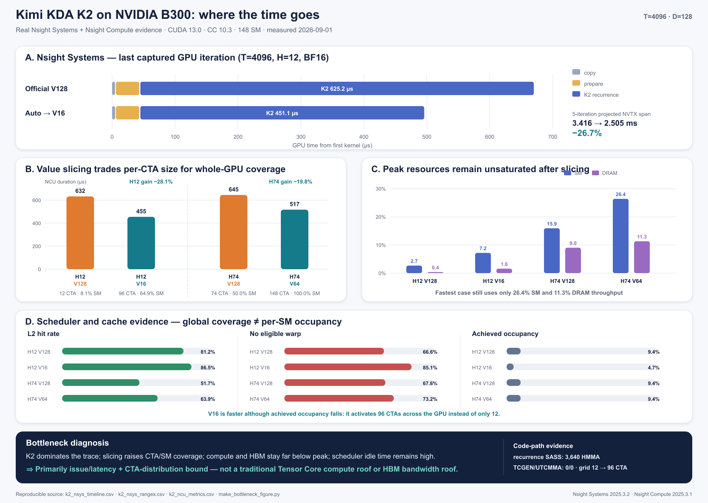

# Kimi KDA K2：B300 trace/profile 瓶颈分析

## 结论先行

在 `T=4096, D=128, BF16` 的 B300 实测中，K2 recurrence 是 forward GPU 时间的主体。TP8 代表形状 `H=12` 下，官方 V128 只发射 12 个 recurrence CTA；自动 dispatcher 选择 V16 后发射 96 个 CTA。Nsight Systems 最后一轮捕获中，K2 从 625.2 µs 降到 451.1 µs；五轮 NVTX GPU projected span 从 3.416 ms 降到 2.505 ms（−26.7%）。

Nsight Compute 同时显示：优化后 SM throughput 仅 7.18%，DRAM throughput 仅 1.58%，且 `No Eligible` 为 85.08%。因此当前边界不是传统 Tensor Core compute roof 或 HBM bandwidth roof，而是 recurrence/TMA 的 issue latency、长串行关键路径，以及 CTA 在整张 GPU 上的分布不足。



可编辑矢量版见 `figures/kimi_kda_b300_bottleneck.svg`。图片由 `make_bottleneck_figure.py` 直接读取 profiler CSV 生成，没有使用图像生成模型。

## 1. 为什么 trace 和 profile 都需要

- Nsight Systems 回答“时间花在哪个 kernel、kernel 之间有没有空洞、一次完整调用的关键路径是什么”。它证明 K2 recurrence 主导这条调用链。
- Nsight Compute 回答“这个 kernel 为什么慢”：grid/CTA、SM/DRAM throughput、L2 hit、occupancy 与 scheduler 指标。它用来区分 compute、bandwidth、资源和 latency/issue 边界。
- SASS/源码回答“实际走了哪类 Tensor Core 指令路径”。当前 K2 源码使用 `SM80_16x8x16_F32BF16BF16F32_TN` MMA atom；本次 recurrence SASS 汇总出现 3,640 条 `HMMA.16816.F32.BF16` 静态指令，`TCGEN`/`UTCMMA` 均为 0。

单看 timeline 能定位 K2，却不能给出瓶颈类型；单看一组 NCU 计数器又容易忽略整次调用的关键路径。两者合起来才足够。

## 2. Nsight Systems 时间线

捕获脚本在同一进程、同一扩展中先运行 5 次强制 V128，再运行 5 次自动 dispatcher。使用 CUDA profiler API 限定捕获范围，并用 NVTX 标记两段：

| 路径 | GPU projected span（5 次） | 最后一轮 prepare | 最后一轮 K2 | recurrence grid |
|---|---:|---:|---:|---:|
| Official V128 | 3.416 ms | 37.09 µs | 625.16 µs | `1×12×1 = 12 CTA` |
| Auto → V16 | 2.505 ms | 37.15 µs | 451.08 µs | `1×12×8 = 96 CTA` |

prepare 基本没有变化，减少的时间集中在 K2 recurrence。五轮 span 降低 26.7%，最后一轮 K2 降低 27.8%，二者方向一致。

## 3. Nsight Compute 对照

下表的 duration 只在同一次 NCU 诊断口径中比较；NCU 有 replay/计数器开销，不能直接与正常 CUDA Event benchmark 或 Nsight Systems 的绝对延迟混用。

| 配置 | CTA | 理想 SM 覆盖上限 | Duration | SM throughput | DRAM throughput | L2 hit | No eligible | Achieved occupancy |
|---|---:|---:|---:|---:|---:|---:|---:|---:|
| H12 V128 | 12 | 8.1% | 632.32 µs | 2.66% | 0.36% | 81.15% | 66.63% | 9.38% |
| H12 V16 | 96 | 64.9% | 454.69 µs | 7.18% | 1.58% | 86.51% | 85.08% | 4.69% |
| H74 V128 | 74 | 50.0% | 645.06 µs | 15.92% | 9.02% | 51.74% | 67.56% | 9.37% |
| H74 V64 | 148 | 100.0% | 517.31 µs | 26.37% | 11.30% | 63.88% | 73.19% | 9.37% |

H12 从 V128 到 V16 的 NCU duration 降低 28.1%；H74 从 V128 到 V64 降低 19.8%。两组都随着 CTA/SM 覆盖增加而加速，但最快配置仍只有 26.37% SM throughput 和 11.30% DRAM throughput，所以不能把它描述成已经撞到计算峰值或带宽峰值。

## 4. 为什么 V16 occupancy 更低却更快

这两个指标描述的层次不同：

- `12/148` 与 `96/148` 是整张 GPU 的 grid 覆盖问题。官方 H12 最多只能让约 8.1% 的 SM 同时拿到一个 CTA；V16 最多可覆盖约 64.9%。
- `Achieved Occupancy` 是已活跃 SM 内的 resident/active warp 比例。V16 每个 CTA 的线程数从 192 降到 96，因此即使更多 SM 被激活，单个活跃 SM 的 warp occupancy 也可能下降。
- `No Eligible` 仍高，说明每个活跃 CTA 内部仍经常等待 recurrence/TMA/依赖链。ValueSlice 缩短了每个 CTA 的工作并增加独立 CTA，但没有消除 CTA 内的 issue latency。

所以“全局更多 SM 在工作”和“每个活跃 SM 上 resident warp 比例较低”可以同时成立。这里性能改善主要来自前者，而不是靠提高单 SM occupancy。

## 5. 对 SM80 与 SM100 路线的含义

当前 K2 的自然主 tile 是 `M=16`，源码使用 SM80 `m16n8k16` BF16 MMA atom。仅把它机械替换成 SM100 `tcgen05`，不会修复 12 CTA 对 148 SM 的结构性不足，还会引入更大 tile、TMEM 和异步同步的固定成本。

更合理的顺序是：

1. 保留已经验证的 ValueSlice/dispatcher，先修复整卡并行度；
2. 用 CTA Cluster + TMA multicast 减少不同 ValueSlice 重复读取 K-only workspace；
3. 只对 `M=128` state-update 阶段做隔离的 `tcgen05` microbenchmark；
4. 若新路径在完整调用链上有净收益，再并入受保护的 SM100/SM103 专用分支。

## 6. 可复现与归档

数据链：

```text
.nsys-rep → .sqlite / nvtx_gpu_proj_trace → k2_nsys_*.csv
.ncu-rep  → ncu --import --page details → k2_ncu_metrics.csv
CSV       → make_bottleneck_figure.py → editable SVG → PNG
binary    → cuobjdump --dump-sass → summarize_sass.py
```

本地重建图：

```bash
python3 extract_nsys_timeline.py \
  artifacts/nsys/kda_t4096_h12_v128_vs_auto.sqlite \
  artifacts/nsys/kda_t4096_h12_v128_vs_auto_stats.csv \
  --timeline data/k2_nsys_timeline.csv \
  --ranges data/k2_nsys_ranges.csv
python3 make_bottleneck_figure.py
node render_figure_png.mjs  # optional; requires the sharp package
```

本机 `artifacts/` 保存可在 Nsight GUI 中重新打开的原始报告；它们含服务器路径、PID 和环境元数据，因此被 Git 忽略，不上传到公开仓库。公开的 `data/` 保存已脱敏、适合代码审阅和画图的紧凑 CSV，`trace_k2_pair.py` 与 `run_nsys_trace.sbatch` 保存采集方法。完整 SASS 文本体积较大且含完整二进制符号，不放入仓库；仓库只保存 opcode 汇总与 40 个 recurrence 样例，配合 `summarize_sass.py` 可从完整 listing 重建。

## 7. 限制

1. 这是 KDA operator/K2 的诊断，不是完整 Kimi serving 的 TTFT、tokens/s 或端到端吞吐。
2. 这次 Systems 对比聚焦 `H=12`；H74 来自同一扩展、同一 B300 上的 NCU resource/roofline 对照。
3. Nsight Systems、Nsight Compute 与 CUDA Event 的 instrumentation 不同，只能在各自一致口径内比较绝对时间。
4. `No Eligible` 是现象证据，不应单独当成唯一因果；这里的判断还依赖 trace 主导 kernel、grid 覆盖和低峰值吞吐共同成立。
